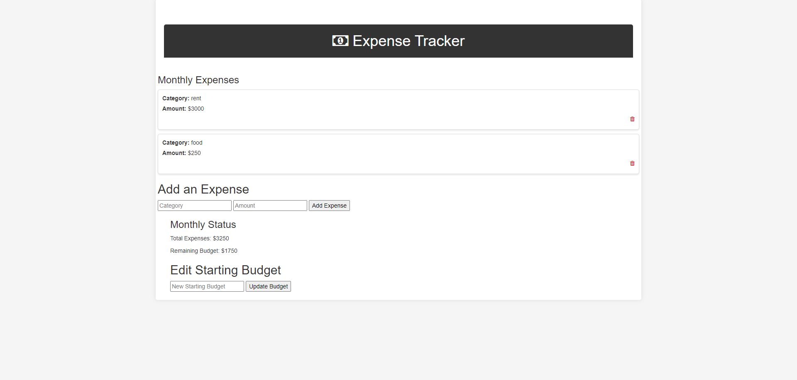

## Installation

1. Clone repo
2. run `npm install`

## Usage

1. run `node server.js`
2. Navigate to `localhost:8080`

## Credit

            Modified from Scotch.io's auth tutorial
## Usage
            Visit the home page and create an account or log in if you already have one.
            Set your budget and start adding expenses.
            View your profile to see your budget, expenses, and remaining budget.
# Edit your budget or delete expenses as needed.
Technologies Used
        Express.js: This web application is built using Express.js, a Node.js web application framework.
        MongoDB: MongoDB is used as the database to store user accounts, budgets, and expenses.
        Passport.js: Passport is used for user authentication.
        HTML & CSS: The user interface is created using HTML and styled with CSS.
        Font Awesome: Icons are provided by Font Awesome to enhance the user experience.
## Folder Structure
        views: Contains the HTML templates for the application's web pages.
        public: Includes static assets like CSS files and client-side JavaScript.
        routes: Defines the routes and controllers for handling HTTP requests.